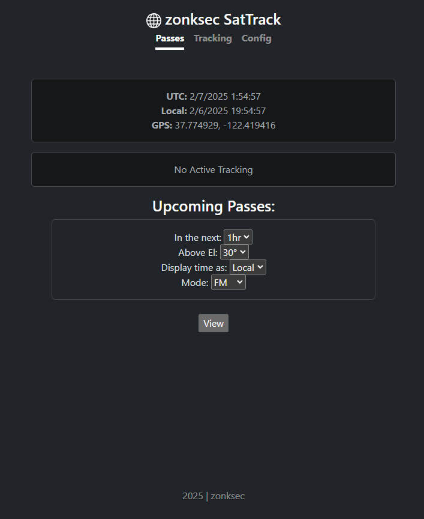
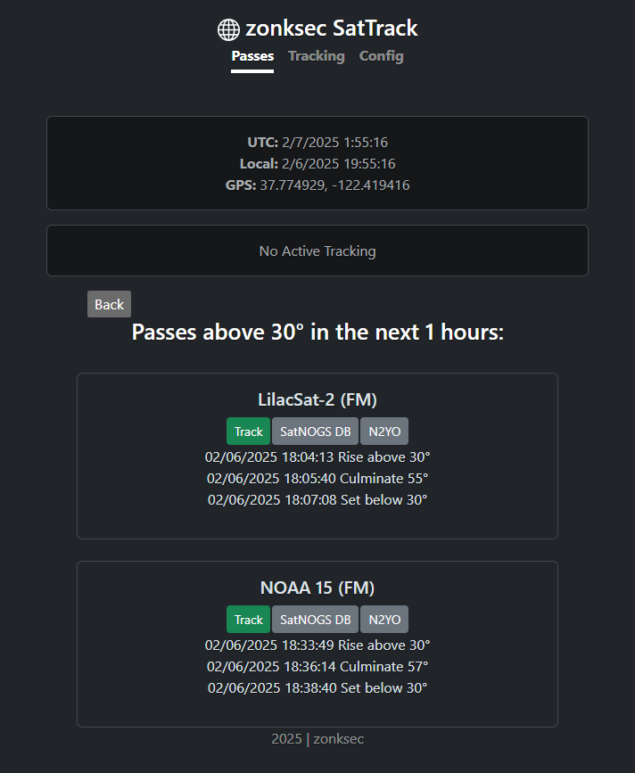
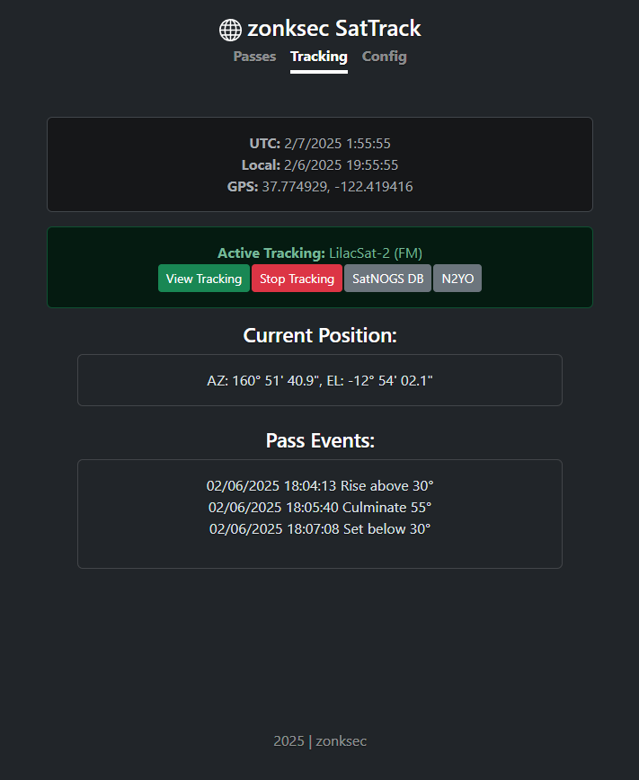
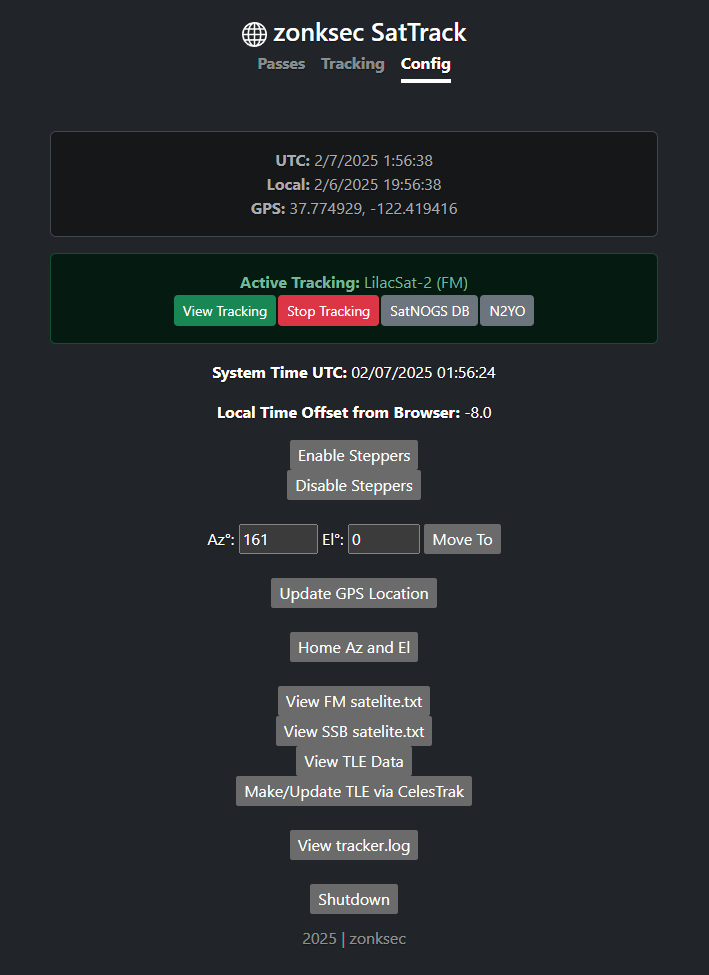

# SatTrack
DIY Satellite Tracker for Ham Radio
* For [Arrow II Sat Antenna](https://www.arrowantennas.com/arrowii/146-437.html)
* improved 3D printed parts | [original design by jbyrns](https://www.thingiverse.com/thing:4664558)
* Nema 17 Motors
* on-board tracking software and battery
  * doubles as a counter weight; fewer wires to get tangled 
  * rasperby pi zero
  * custom pcb for:
    * A4988 Stepper Drivers
    * Power regulation
    * Buzzer output
    * Easy connectivity for switches and connections
  * full featured web interface
  * satellite definitions compatible with opengd77

